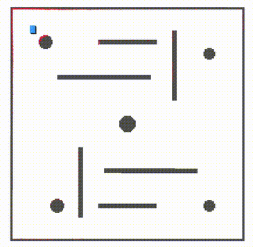

# NeuPAN ROS2 Workspace

<div align="center">

<a href="https://ieeexplore.ieee.org/abstract/document/10938329"></a>
<a href="https://arxiv.org/pdf/2403.06828.pdf"></a>
<a href="https://youtu.be/SdSLWUmZZgQ"></a>
<a href="https://www.bilibili.com/video/BV1Zx421y778/?vd_source=cf6ba629063343717a192a5be9fe8985"></a>
<a href="https://hanruihua.github.io/neupan_project/"></a>
[](https://docs.ros.org/en/humble/)
[](LICENSE)
[](https://www.python.org/)

[English](#overview) | [中文](README_CN.md)

</div>

---

### Overview

**NeuPAN ROS2 Workspace** is a complete ROS2-based navigation system that combines:

- **NeuPAN Planner** ([`src/neupan_ros2`](src/neupan_ros2)): Neural Proximal Alternating Network for end-to-end navigation planning
- **DDR Minimal Sim** ([`src/ddr_minimal_sim`](src/ddr_minimal_sim)): Lightweight differential-drive robot simulator

### Key Features

- 🤖 **End-to-End Learning**: Direct laser scan to velocity command mapping using neural networks
- 🎯 **Real-Time Planning**: Fast neural network inference for responsive navigation
- 🔄 **Sim-to-Real**: Seamless transition between simulation and physical robots (e.g., Limo)
- 🛠️ **Easy Testing**: Pre-configured scenarios for algorithm validation
- 📦 **Modular Design**: Independent packages for flexibility

### Demo

<div align="center">
  
  <p><em>NeuPAN navigating autonomously through a complex maze scenario</em></p>
</div>

### Quick Start

#### 1. Prerequisites

- **ROS2**: Humble or later
- **System**: Ubuntu 22.04 (recommended)
- **Hardware**: CPU (GPU optional)

#### 2. Install Dependencies

```bash
# Navigate to workspace root
git clone https://github.com/KevinLADLee/neupan_ros2.git
cd neupan_ros2

# Run setup script (installs ROS2 and C++ dependencies only)
chmod +x setup.sh
./setup.sh
```

<details>
<summary>Or install manually</summary>

**ROS2 Dependencies:**
```bash
sudo apt update
sudo apt install -y \
    ros-humble-tf2-tools \
    ros-humble-tf2-ros \
    ros-humble-nav-msgs \
    ros-humble-sensor-msgs \
    ros-humble-geometry-msgs \
    ros-humble-visualization-msgs \
    libeigen3-dev \
    libyaml-cpp-dev
```

**Python Dependencies:**

⚠️ **Important:** NeuPAN requires numpy < 2.0

Please refer to the official NeuPAN repository for detailed installation:
**https://github.com/hanruihua/NeuPAN**

Typical installation:
```bash
# Install PyTorch (choose CPU or GPU version from https://pytorch.org)
pip3 install torch torchvision

# Install NeuPAN and dependencies
pip3 install neupan
pip3 install "numpy<2.0" scipy matplotlib pyyaml
```
</details>

#### 3. Build Workspace

```bash
# Use build script
chmod +x build.sh
./build.sh

# Or build manually
colcon build --symlink-install
source install/setup.bash
```

#### 4. Run Demo

**Simulation with NeuPAN:**
```bash
source install/setup.bash
ros2 launch neupan_ros2 sim_diff_launch.py sim_env_config:=scenario_corridor.yaml
```

**Alternative scenarios:** See [ddr_minimal_sim scenarios](src/ddr_minimal_sim/README.md#pre-configured-scenarios) for complete list (corridor, maze, narrow_passage, u_trap, polygon_random, empty)

### Usage Scenarios

#### Scenario 1: Real Robot Deployment (Limo)

Deploy NeuPAN on physical Limo robot:

```bash
# Make sure Limo drivers are running
ros2 launch neupan_ros2 limo_diff_launch.py
```

#### Scenario 2: Complete Simulation

Full system with simulator + NeuPAN planner:

```bash
ros2 launch neupan_ros2 sim_diff_launch.py

ros2 launch neupan_ros2 sim_diff_launch.py sim_env_config:=scenario_maze.yaml
```

### Package Details

#### 📦 src/neupan_ros2

ROS2 implementation of [NeuPAN-ROS](https://github.com/hanruihua/neupan_ros) neural navigation planner.
**[→ Documentation](src/neupan_ros2/README.md)**

#### 📦 src/ddr_minimal_sim

Lightweight differential-drive robot simulator with laser scanning and pre-configured test scenarios.
**[→ Documentation](src/ddr_minimal_sim/README.md)**


### Development

#### Building

```bash
# Build all packages
colcon build --symlink-install

# Build specific package
colcon build --packages-select neupan_ros2
colcon build --packages-select ddr_minimal_sim
```

#### Customization

- **Simulator scenarios**: See [ddr_minimal_sim development guide](src/ddr_minimal_sim/README.md#development) for custom scenarios
- **NeuPAN parameters**: Modify `src/neupan_ros2/config/neupan_config/neupan_sim_diff.yaml`

### Citation

If you find this code or paper helpful, please kindly star ⭐ this repository and cite our paper:

```bibtex
@ARTICLE{10938329,
  author={Han, Ruihua and Wang, Shuai and Wang, Shuaijun and Zhang, Zeqing and Chen, Jianjun and Lin, Shijie and Li, Chengyang and Xu, Chengzhong and Eldar, Yonina C. and Hao, Qi and Pan, Jia},
  journal={IEEE Transactions on Robotics}, 
  title={NeuPAN: Direct Point Robot Navigation With End-to-End Model-Based Learning}, 
  year={2025},
  volume={41},
  number={},
  pages={2804-2824},
  doi={10.1109/TRO.2025.3554252}}
```

### License

This project is licensed under the **GNU General Public License v3.0** - see the [LICENSE](LICENSE) file for details.

This maintains consistency with [NeuPAN-ROS](https://github.com/hanruihua/neupan_ros) (ROS1 version).

### Troubleshooting

<details>
<summary>Build errors</summary>

- Ensure all dependencies are installed: `./setup.sh`
- Check ROS2 sourced: `source /opt/ros/humble/setup.bash`
- Clean build: `rm -rf build install log && colcon build`
</details>

<details>
<summary>Runtime errors</summary>

- Verify package discovery: `ros2 pkg list | grep -E "neupan|ddr"`
- Check topics: `ros2 topic list`
- Review logs: `ros2 run rqt_console rqt_console`
</details>

<details>
<summary>NeuPAN model not found</summary>

- Check model file exists: `src/neupan_ros2/config/dune_checkpoint/model_5000.pth`
- Download from repository if missing
</details>

### Contributing

Contributions welcome! Submit issues or pull requests on [GitHub](https://github.com/KevinLADLee/neupan_ros2).

### Acknowledgments

- [NeuPAN](https://github.com/hanruihua/NeuPAN) & [NeuPAN-ROS](https://github.com/hanruihua/neupan_ros) - Original algorithm
- [DDR-opt](https://github.com/ZJU-FAST-Lab/DDR-opt) - Simulator reference
- ROS2 integration optimized for [AgileX Limo](https://global.agilex.ai/products/limo-pro) by [HiveMatrix Limited](mailto:sales@hive-matrix.com)
  - *Interested in Limo robots or technical support? Contact HiveMatrix - your commercial support empowers continued open-source development*

---

**Author**: KevinLADLee (kevinladlee@gmail.com)
